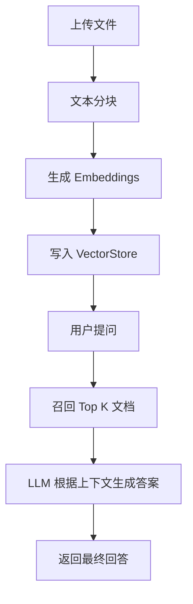

# 🧠 Nexa-Hub

> 💬 一个统一的多模型智能对话与知识检索平台，支持接入多家大模型（OpenAI、Qwen、Gemini 等），并提供本地知识库索引（RAG）能力。

---

## 🚀 功能概览

| 模块 | 说明 |
|------|------|
| 💬 **Chat 模块** | 调用多种大模型进行上下文对话（统一 `/api/chat` 接口）。 |
| 📚 **Knowledge 模块（RAG）** | 支持文件上传、文本分块、向量化、检索与问答。 |
| 🧩 **Session 记忆** | 在同一 `session_id` 下保存多轮上下文。 |
| ⚙️ **Model Registry** | 支持多模型注册与动态切换。 |
| 🌐 **Web 前端** | 简洁的微信风格聊天界面。 |

---

## 🗂️ 项目结构

```
nexa-hub/
├── app/
│   ├── main.py                 # FastAPI 主入口
│   ├── routers/
│   │   ├── chat_api.py         # 聊天接口
│   │   └── knowledge_api.py    # 知识检索接口
│   └── core/                   # 通用配置模块
│
├── bots/
│   ├── base_bot.py             # 抽象基类
│   ├── openai_bot.py           # OpenAI Bot
│   ├── qwen_bot.py             # 通义千问 Bot
│   ├── gemini_bot.py           # Gemini Bot
│   └── model_registry.py       # 模型注册中心
│
├── knowledge/
│   ├── rag_pipeline.py         # 检索增强问答核心逻辑
│   ├── embeddings.py           # 向量化模型封装
│   ├── vectorstore.py          # 向量库存取与加载
│
├── web/
│   └── templates/
│       └── chat.html           # 前端聊天界面（微信风格）
│
├── data/
│   ├── uploads/                # 上传文件临时目录
│   └── vector_stores/          # 向量化知识库
│
├── config.json                 # 全局配置
└── README.md                   # 项目说明
```

---

## ⚙️ 安装与运行

### 1️⃣ 安装依赖
```bash
pip install -r requirements.txt
```

### 2️⃣ 配置环境变量
在系统环境或 `.env` 文件中添加：

```bash
OPENAI_API_KEY=sk-xxxx
OPENAI_BASE_URL=https://api.openai.com/v1
```

如果使用其他模型（如 Qwen、Gemini），可在 `config.json` 中添加对应 key。

### 3️⃣ 启动后端服务
```bash
uvicorn app.main:app --reload --port 8000
```

访问地址：
```
http://127.0.0.1:8000/api/chat/
http://127.0.0.1:8000/api/knowledge/query
```

---

## 💡 前端运行

在 `web/templates` 目录下运行：

```bash
cd web/templates
python -m http.server 63342
```

然后访问：
```
http://127.0.0.1:63342/chat.html
```

> 💬 聊天页面为微信风格布局，用户消息在右侧，AI 回复在左侧。

---

## 🧠 API 使用说明

### 1. 聊天接口

**POST** `/api/chat/`

**请求示例：**
```json
{
  "query": "你好，介绍一下你自己",
  "model": "openai:gpt-3.5",
  "session_id": "test-session"
}
```

**响应示例：**
```json
{
  "text": "你好，我是 Nexa-Hub 智能助手！",
  "model": "openai:gpt-3.5",
  "session_id": "test-session"
}
```

---

### 2. 文件上传接口

**POST** `/api/knowledge/upload`

表单参数（form-data）：

| 参数 | 说明 |
|------|------|
| file | 上传的文档文件（支持 PDF / TXT / DOCX） |
| namespace | 知识库命名空间（可选，默认 default） |

---

### 3. 知识问答接口（RAG）

**POST** `/api/knowledge/query`

**请求示例：**
```json
{
  "question": "什么是模型微调？",
  "namespace": "test",
  "top_k": 3,
  "model": "openai:gpt-3.5"
}
```

**响应示例：**
```json
{
  "answer": "模型微调是指在预训练模型基础上对特定任务进行再训练的过程。",
  "namespace": "test"
}
```

---

## 🧩 模型注册机制

所有模型均通过 `ModelRegistry` 统一管理。

示例：
```python
from bots.model_registry import model_registry
from bots.openai_bot import OpenAIBot

# 注册新模型
model_registry.register("openai:gpt-4", OpenAIBot)
```

新增自定义模型：
```python
from bots.base_bot import BaseBot

class MyBot(BaseBot):
    def reply(self, query: str) -> str:
        return "hello"

    def reply_with_context(self, messages):
        return "response with context"
```

---

## 🔍 知识检索（RAG）流程



---

## 🧪 调试与开发

```bash
# 格式化代码
black .

# 运行测试
pytest -v

# 启动调试模式
uvicorn app.main:app --reload
```

---

## 📦 技术栈

| 分类 | 技术 |
|------|------|
| 后端框架 | FastAPI |
| 模型接口 | LangChain + OpenAI / Qwen / Gemini |
| 向量库 | FAISS |
| 前端界面 | HTML + 原生 JS |
| 日志记录 | loguru |

---

## 📘 版本规划

| 版本 | 内容 |
|------|------|
| ✅ v1.0 | 多模型对话 + 知识检索基础功能 |
| 🔄 v1.1 | WebSocket 流式输出、上下文优化 |
| 🔜 v1.2 | 用户登录、命名空间隔离、权限系统 |

---

## 📜 License

MIT License © 2025 Nexa-Hub Team
